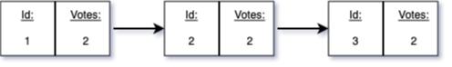
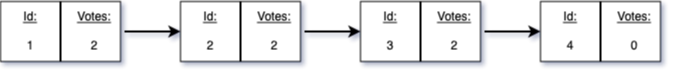
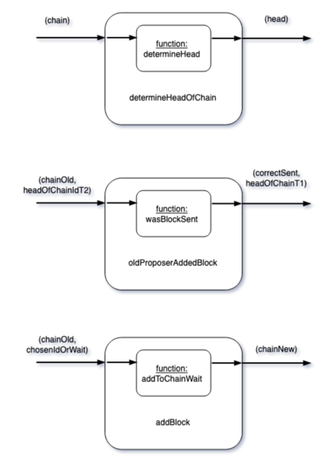
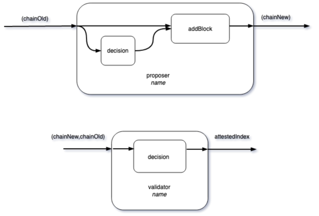
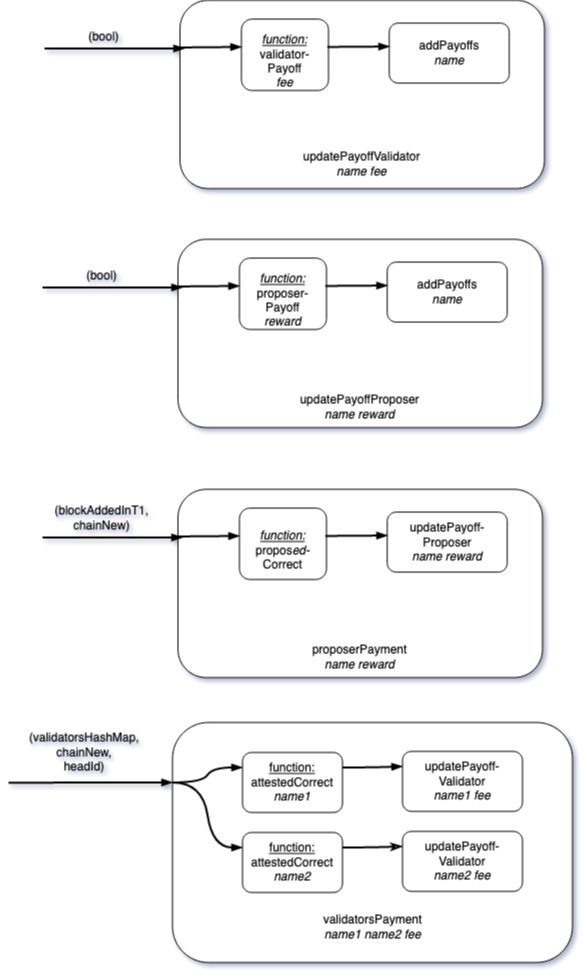
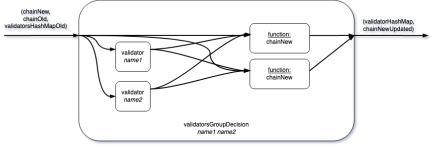
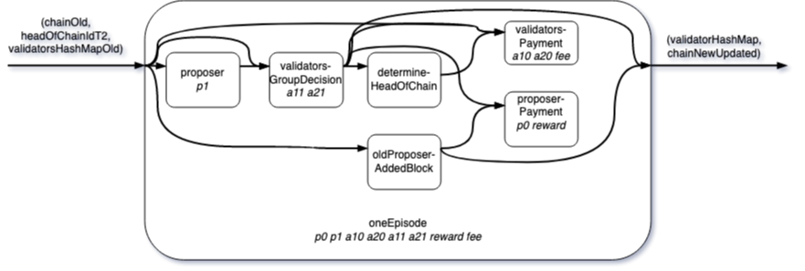
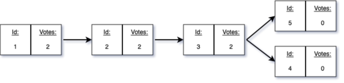

## Introduction

Some time ago, in a [previous blog post](https://statebox.org/blog/compositional-game-engine/), we introduced our software engine for game theoretic modelling. In this post, we expand more on how to apply the engine to use cases relevant for the Ethereum ecosystem. We will consider an analysis of a simplified staking protocol. Our focus will be on compositionality – what this means from the perspective of representing protocols and from the perspective of analyzing protocols.

We end with an outlook on the further development of the engine, what its current limitations are and how we work on overcoming them.

The codebase of the example discussed can be found [here](https://github.com/20squares/block-validation). If you have never seen the engine before, we advise you to go back to our earlier post. Also note that there exists a basic [tutorial](https://github.com/philipp-zahn/open-games-engine/blob/master/Tutorial/TUTORIAL.md) that explains how the engine works. Lastly, here is a recent [presentation](https://www.youtube.com/watch?v=fucygCyCyo8) Philipp gave at the [Ethconomics workshop at DevConnect Amsterdam](https://ef-events.notion.site/ETHconomics-Devconnect-676d73f791684e18bfae35bbc9e1fa90).

## Preliminaries

Consider a simplified model of a staking protocol. The staking protocol is motivated by [Ethereum proof of stake](https://ethereum.org/en/developers/docs/consensus-mechanisms/pos/). The model we introduce is relevant as, even though simple, it shines a light on how a previous version of the staking protocol was subject to reorg attacks as discussed in this [paper](https://arxiv.org/abs/2110.10086). We thank Barnabé Monnot for pointing us to the problem in the first place and helping us with the specification and modelling.

In what follows, we give a short verbal summary of the protocol.

To begin with, we model a chain as a (compositional) relation. The chain contains blocks with unique identifiers as well as voting weights. The weights correspond to votes by validators on the specific blocks contained in the chain. Here is an example of such a chain in the case of two validators:



The staking protocol consists of episodes. Within each episode, which lasts for several time steps, a *proposer* decides to extend the chain by a further block. The proposer can decide to extend or not to extend it. If the proposer extends the chain, he chooses on which block to build. Consider the following example when the proposer extends the above chain:



The new block he generates will have initially no votes attesting to this block being the legitimate successor. This assessment is conducted by two validators.

These two validators observe the last stage of the chain before their episode starts and they observe a possible change to the chain made by the proposer within their episode. The validators can then vote on the block which they view as the legitimate successor. Here is the continued example from above:


Both the proposer’s as well as the validators’ choices will be evaluated in the next episode. If the decisions they made, i.e. the building on a specific block by the proposer as well as the voting by the validators, is on the path to the longest weighted chain, they will receive a reward.

From a modelling perspective, this is an important feature. The agents’ remuneration in episode $t$ will be determined in episode $(t+1)$. We will come back to this feature.

So far, the setup seems simple enough. However, the picture is complicated by possible network issues. Messages may be delayed. For instance, the two validators might not observe a message by the proposer in their episode simply due to the network being partitioned.

Hence, in this specific case, the validators cannot be sure when a message does *not* reach them, that the message was actually not sent, or that they just have not received it yet.

Real world network issues like delay complicate the incentives. They also open avenues for malicious agents. Modelling the arising incentive problems in game-theoretic terms is a formidable challenge as the timing of moves and information is itself affected by the moves of players. For instance, in the reorg attack mentioned in the beginning, a malicious proposer might want to wait with sending information until the next episode has started. In that way he might draw validators away from the honest proposer of that episode and instead have them vote on his block that he created late.

The practical modelling of such interactions is not obvious (and in fact motivated a new research project on our end). Here, we dramatically simplify the problem. We get rid of time completely. Instead, we leverage a key feature of our approach: Games are defined as open systems —- open to their environment and waiting for information.

Through the environment we can feed in specific information we want. Concretely, we can expose the proposer and validators in a given episode exactly to the kind of reorg scenario mentioned above: Proposer and validators are facing differing information regarding the state of the chain.

Besides simplifying the model, proceeding in this way has a further advantage. The analysis of optimal moves is static and only relative to the context. It thereby becomes much simpler.<sup>[^1]</sup>
[^1]: This is not the only way to model the protocol in the current implementation. It is also possible to consider a timer explicitly as a state variable. This [branch](https://github.com/20squares/block-validation/tree/timer) contains such a model.

## Representing the protocol as a compositional game

In order to construct a game-theoretic model of the protocol, we will build up the protocol from the bottom up using building blocks.

### Building blocks

We begin with the boring but necessary parts that describe the mechanics of the protocol. These components are mostly functions lifted into games as computations. In order not to introduce too much clutter in this post, we focus on the open games representations and hide details of the auxiliary function implementations. These functions are straightforward and is should be hopefully clear from the context what they do.

#### Auxiliary components

Given a chain, `determineHeadOfChain` produces the head of the current chain:

```haskell
determineHeadOfChain = [opengame|
  inputs    : chain ;
  feedback  :   ;
 
  :-----:
  inputs    : chain ;
  feedback  :   ;
  operation : forwardFunction $ determineHead ;
  outputs   : head ;
  returns   : ;
  :-----:
 
  outputs   : head ;
  returns   :  ;
 
|]
```

Given the old chain from $(t-1)$ and the head of the chain from $(t-2)$, `oldProposerAddedBlock` determines whether the proposer actually did send a new block in $(t-1)$. It also outputs the head of the chain for period $(t-1)$ - as this is needed in the next period.

```haskell
oldProposerAddedBlock = [opengame|
 
    inputs    : chainOld, headOfChainIdT2 ;
    feedback  :   ;
 
    :-----:
    inputs    : chainOld, headOfChainIdT2 ;
    feedback  :   ;
    operation : forwardFunction $ uncurry wasBlockSent ;
    outputs   : correctSent, headOfChainIdT1 ;
    returns   : ;
    :-----:
 
    outputs   : correctSent, headOfChainIdT1 ;
    returns   :  ;
  |]
```

Given the decision by the proposer to either wait or to send a head, `addBlock` creates a new chain. Which means either the old chain is copied as before or the chain is actually appended by a new block.

```haskell
addBlock = [opengame|
 
    inputs    : chainOld, chosenIdOrWait ;
    feedback  :   ;
 
    :-----:
    inputs    : chainOld, chosenIdOrWait ;
    feedback  :   ;
    operation : forwardFunction $ 
                  uncurry addToChainWait ;
    outputs   : chainNew ;
    returns   : ;
 
    :-----:
 
    outputs   : chainNew ;
    returns   :          ;
  |]
```

The following diagram summarizes the information flow in these building blocks.



#### Decisions

Given the old chain from $(t-1)$, proposer decides to append the block to a node or not to append. Conditional on that decision, a new chain is created.

```haskell
proposer name = [opengame|
  inputs    : chainOld;
  feedback  :   ;
 
  :-----:
  inputs    : chainOld ;
  feedback  :   ;
  operation : dependentDecision name
                 alternativesProposer;
  outputs   : decisionProposer ;
  returns   : 0;
 
  inputs    : chainOld, decisionProposer ;
  feedback  :   ;
  operation : addBlock ;
  outputs   : chainNew;
  returns   : ;
  //  
 
  :-----:
 
  outputs   : chainNew ;
  returns   :  ;
|]
```

Given a new chain proposed and the old chain from $(t-1)$, validator then decides which node to attest as the head.

```haskell
validator name = [opengame|
 
    inputs    : chainNew,chainOld ;
    feedback  :  ;
 
    :-----:
    inputs    : chainNew,chainOld ;
    feedback  :   ;
    operation : dependentDecision name 
                  (\(chainNew, chainOld) -> 
                      [1, vertexCount chainNew]) ;
    outputs   : attestedIndex ;
    returns   : 0 ;
    // ^ NOTE the payoff for the validator comes from the next period
 
    :-----:
 
    outputs   : attestedIndex ;
    returns   :  ;
  |]
```

This open game is parameterized by a specific player (`name`). The information flow of the decision open games are depicted in in the next diagram:



#### Payoffs

The central aspect of the protocol is how the payoffs of the different players are determined. For both proposers and validators we split the payoff components into two parts. First, we create open games which are mere accounting devices, i.e. they just update a player’s payoff.

`updatePayoffValidator` (i) determines the value that an validator should receive conditional on his action being assessed as correct and (ii) updates the value for a specific validator. This open game is parameterized by a specific player (`name`).

```haskell
updatePayoffValidator name fee  = [opengame|
    inputs    : bool ;
    feedback  :   ;
 
    :-----:
    inputs    : bool ;
    feedback  :   ;
    operation : forwardFunction $ validatorPayoff fee ;
    outputs   : value ;
    returns   : ;
    // ^ Determines the value
 
 
    inputs    : value ;
    feedback  :   ;
    operation : addPayoffs name ;
    outputs   : ;
    returns   : ;
    :-----:
 
    outputs   :  ;
    returns   :  ;
 
  |]
```

`updatePayoffProposer` works analogously to the validators'. First, determine the value the proposer should receive depending on his action. Second, do the book-keeping and add the payoff to `name`'s account.

```haskell
updatePayoffProposer name reward  = [opengame|
    inputs    : bool ;
    feedback  :   ;
 
    :-----:
    inputs    : bool ;
    feedback  :   ;
    operation : forwardFunction $ proposerPayoff reward;
    outputs   : value ;
    returns   : ;
    // ^ Determines the value
 
 
    inputs    : value ;
    feedback  :   ;
    operation : addPayoffs name ;
    outputs   : ;
    returns   : ;
    :-----:
 
    outputs   :  ;
    returns   :  ;
 
  |]
```

`proposerPayment` embeds `updatePayoffProposer` into a larger game where the first stage includes a function, `proposedCorrect`, lifted into the open game. That function does what its name suggests, given the latest chain and a Boolean value whether the proposer actually added a block, it determines whether the proposer proposed correctly - according to the protocol.

```haskell
proposerPayment name reward = [opengame|
 
    inputs    : blockAddedInT1, chainNew ;
    feedback  :   ;
 
    :-----:
    inputs    : blockAddedInT1, chainNew ;
    feedback  :   ;
    operation : forwardFunction $ uncurry 
                  proposedCorrect ;
    outputs   : correctSent ;
    returns   : ;
    // ^ This determines whether the proposer was 
         correct in period (t-1)
 
 
    inputs    : correctSent ;
    feedback  :   ;
    operation : updatePayoffProposer name reward;
    outputs   : ;
    returns   : ;
    // ^ Updates the payoff of the proposer given
         decision in period (t-1)
 
    :-----:
 
    outputs   : ;
    returns   :  ;
  |]
```

This last game already show-cases a pattern that we will see from now on repeatedly. Using the primitive components, we go on to build up larger games. All the needed "molding" parts have been put on the table. All what follows will be about composing those elements.

Let us consider another example for composition.

`validatorsPayment` groups the payment for validators included, here two, into one game.

```haskell
validatorsPayment name1 name2 fee = [opengame|
 
    inputs    : validatorHashMap, chainNew, headId;
    feedback  :   ;
 
    :-----:
    inputs    : validatorHashMap, chainNew, headId ;
    feedback  :   ;
    operation : forwardFunction $ uncurry3 $
                 attestedCorrect name1 ;
    outputs   : correctAttested1 ;
    returns   : ;
    // ^ This determines whether validator 1 was
         correct in period (t-1) using the latest
         hash and the old information
 
    inputs    : validatorHashMap, chainNew, headId ;
    feedback  :   ;
    operation : forwardFunction $ uncurry3 $ 
                   attestedCorrect name2 ;
    outputs   : correctAttested2 ;
    returns   : ;
    // ^ This determines whether validator 2 was
         correct in period (t-1)
 
 
    inputs    : correctAttested1 ;
    feedback  :   ;
    operation : updatePayoffValidator name1 fee ;
    outputs   : ;
    returns   : ;
    // ^ Updates the payoff of validator 1 given
         decision in period (t-1)
 
    inputs    : correctAttested2 ;
    feedback  :   ;
    operation : updatePayoffValidator name2 fee ;
    outputs   : ;
    returns   : ;
    // ^ Updates the payoff of validator 2 given
         decision in period (t-1)
 
        :-----:
 
    outputs   :  ;
    returns   :  ;
  |]
```

This concludes the blocks for generating payments. The information flow of these components is depicted in the following diagram:



`validatorsGroupDecision`` groups all validators' decisions considered into one game. The output of this game is a map (in the programming sense) connecting the name of the validator with her/his decision.

```haskell
validatorsGroupDecision name1 name2 = [opengame|
 
    inputs    : chainNew,chainOld, validatorsHashMapOld ;
    feedback  :   ;
 
    :-----:
 
    inputs    : chainNew, chainOld ;
    feedback  :   ;
    operation : validator name1  ;
    outputs   : attested1 ;
    returns   : ;
    // ^ Validator1 makes a decision
 
    inputs    : chainNew, chainOld ;
    feedback  :   ;
    operation : validator name2  ;
    outputs   : attested2 ;
    returns   : ;
    // ^ Validator2 makes a decision
 
    inputs    : [(name1,attested1),(name2,attested2)],
                validatorsHashMapOld ;
    feedback  : ;
    operation : forwardFunction $ uncurry 
                  newValidatorMap ;
    outputs   : validatorHashMap ;
    returns   : ;
    // ^ Creates a map of which validator voted for
         which index
 
    inputs    : chainNew, [attested1,attested2] ;
    feedback  : ;
    operation : forwardFunction $ uncurry updateVotes ;
    outputs   : chainNewUpdated;
    returns   : ;
    // ^ Updates the chain with the relevant votes
 
 
    :-----:
 
    outputs   : validatorHashMap, chainNewUpdated;
    returns   :  ;
  |]
```

The group of validators together is not really anything exciting but it serves to illustrate a general point. The nesting of smaller games into larger games is mostly about establishing clear interfaces. As long as we do not change the interfaces, we can change the internal behavior. When we build our model in several steps and refine it over time, this is very helpful. Here, for instance, the payment for an individual validator might change. But such a change is only required in one place - assuming the interaction with the outside world does not change - and will not affect the wider construction of the game. In other words, it reduces efforts in rewriting games.

Similarly, we chose the output type of the grouped validators with the intention that it would be easy to add more validators while keeping the interface, the mapping of validators to their decisions, intact.

The next diagram illustrates the composition of components and the information flow.



### Integrating the components towards one episode

Having assembled all the necessary components, we can now turn to a model of an episode of the complete protocol.

Given the previous chain $(t-1)$, the block which was the head of the chain in $(t-2)$, and the voting decisions of the previous validators, this game puts all the decisions together.

```haskell
oneEpisode p0 p1 a10 a20 a11 a21 reward fee = [opengame|
 
    inputs    : chainOld, headOfChainIdT2, 
                validatorsHashMapOld  ;
    // ^ chainOld is the old hash
    feedback  :   ;
 
    :-----:
    inputs    : chainOld ;
    feedback  :   ;
    operation : proposer p1 ;
    outputs   : chainNew ;
    returns   : ;
    // ^ Proposer makes a decision, a new hash is
         proposed
 
    inputs    : chainNew,chainOld, validatorsHashMapOld;
    feedback  :   ;
    operation : validatorsGroupDecision a11 a21 ;
    outputs   : validatorHashMapNew, chainNewUpdated ;
    returns   :  ;
    // ^ Validators make a decision
 
    inputs    : chainNewUpdated ;
    feedback  :   ;
    operation : determineHeadOfChain ;
    outputs   : headOfChainId ;
    returns   : ;
    // ^ Determines the head of the chain
 
    inputs    : validatorsHashMapOld, chainNewUpdated,
                headOfChainId ;
    feedback  :   ;
    operation : validatorsPayment a10 a20 fee ;
    outputs   : ;
    returns   : ;
    // ^ Determines whether validators from period (t-1)
         were correct and get rewarded
 
    inputs    : chainOld, headOfChainIdT2 ;
    feedback  :   ;
    operation : oldProposerAddedBlock ;
    outputs   : blockAddedInT1, headOfChainIdT1;
    returns   : ;
    // ^ This determines whether the proposer from 
         period (t-1) did actually add a block or not
 
    inputs    : blockAddedInT1, chainNewUpdated ;
    feedback  :   ;
    operation : proposerPayment p0 reward ;
    outputs   :  ;
    returns   :  ;
    // ^ This determines whether the proposer from  
         period (t-1) was correct and triggers payments
         accordingly
 
    :-----:
 
    outputs   : chainNewUpdated,  headOfChainIdT1,
                validatorHashMapNew  ;
    returns   :  ;
  |]
```

For clarity, the diagram below illustrates the interacting of the different components and their information flow.



One important thing to note is that this game representation has no inherent dynamics. This is due to a general principle behind the theory of open games as it does not have the notion of time.<sup>[^2]</sup>
[^2]: We should be more precise: In the current theory of open games there is always a clear notion of causality - who moves when and what is observed when by whom. The relevant "events" can be organized in a relation. This follows the overall categorical structure in which open games are embedded. We are working on a version of the theory where time - or other underlying structures like networks - are what open games are based on.

This is a limitation in the sense that we cannot see the dynamics unfold. It also has advantages though: The incentive analysis has no side-effects; in functional programming terms, it acts like a pure function and is fully referential relative to some state of the game.

### More models from here on

Once we have represented the one-episode model, we have choices. We can directly work with that model. And we will do that in the next section. But we can also construct "larger models": Either by manually combining several episodes into a new multi-episode model or by embedding the single episode into a Markov game structure.

We do not cover the construction proper or the analysis of the Markov game in this post. But the idea is simple: The stage game is a state in a Markov game where the state is fully captured by the inputs to the stage game. A Markov strategy then determines the move in the stage game. This, in turn, allows to derive the next state of the Markov game. To analyze such a game we can approximate the future payoff from the point of view of a single player under the assumption that the other players keep playing their strategy. In that way we can also assess unilateral deviations for the player in focus.

## Analysis

After having established a model of the protocol, let us turn to its analysis. The whole point is of course not to represent the games but to learn something about the incentives of the agents involved.

It is important to note, here, that the model we arrived at above is just *one* possible way to represent the situation. Obviously, the engine cannot guarantee that you end up with a useful model. But what it should guarantee is that you can adapt the model quickly and iterate through a range of models. *The* "one true model" rarely exists. Instead being able to adapt and consider many different scenarios is the default.

We will illustrate two analyses showing that following the protocol’s intention, namely agents who follow the protocol truthfully, end up in an equilibrium. But we also see that in the current form, there are problems if a proposer chooses to delay his message strategically. Thus, this makes the protocol susceptible to attacks.

### Honest behavior

We will first illustrate that the protocol works as intended if all agents involved are honest. They all observe the current head of the chain. Proposers then build a new block on top of that head; validators validate that head. The analysis can be found in `HonestBehavior.hs`.

We use the `oneEpisode` model. That is, we are slicing the protocol into one period and supply the initial information at which that round begins and a continuation for how the game continues in the next round. Recall that the rewards for proposer and validators in period $t$ is determined in period $(t+1)$. This information, the initialization and the continuation are fed in through `initialContextLinear` where *linear* signifies that we consider a non-forked chain.

```haskell
initialContextLinear p a1 a2 reward successFee =
  StochasticStatefulContext
    (pure ((),(initialChainLinear, 3, initialMap)))
    (\_ x -> feedPayoffs p a1 a2 reward successFee x)
```

This expression looks more complicated than it actually is. The first part, `(pure ()),(initialChainLinear, 3, initialMap)))`, determines the starting conditions of the situation we consider. That is, we provide the input parameters which `oneEpisode` expects from us. Among other things, this contains the initial chain we start with. Here, replicated from above as a reminder:


The second part, `(\_ x -> feedPayoffs p a1 a2 reward successFee x)` describes a function which computes the payoff from the current action in the next period. Details of how this payoff is determined can be found under the implementation of `feedPayoffs`.

Again, the way we approach this problem is by exploiting the key feature of open games: the one-episode model is like a pipe expecting some inflows and outflows. Once we have them defined, we can analyze what is going on inside of that "pipe".

The last element needed for our analysis are the strategies. We define "honest" strategies for both proposer and validators: `strategyProposer` and `strategyValidator`.

Both type of agents observe previous information, for instance the past chain, then build on the head of the chain (proposer) or attest the head of the chain (validators).

Note that we include a condition in the strategies that deals with the scenario when there is not a unique head of the chain. In the analysis we focus on here, when everyone behaves honest, we will never reach this case. However, once not all agents are honest, there might be scenarios where the head is not unique. This will be important in the second case we analyze below.

Once we have defined the strategies, there is only one thing left to do: Initialize the game with some parameters, specifically rewards and fees for proposer, respectively validators.

In the file `HonestBehavior.hs` you can find one such parameterization, `analyzeScenario`:

```haskell
analyzeScenario = eqOneEpisodeGame "p0" "p1" "a10" "a20" "a11" "a21" 2 2 strategyOneEpisode (initialContextLinear "p1" "a11" "a21" 2 2)
```

This game employs the honest strategies. If we query it, we see that the proposer as well as the validators have no incentive to deviate. These strategies form an equilibrium - as intended in the design of the protocol.

### Identifying attacks - zooming in

Let us turn to a second analysis. This analysis can be found in `Attacker.hs`.

In that episode we continue to consider the behavior of honest agents. However, these agents will start out on a chain that we assume has been intentionally delayed by the proposer in the episode before. This is achieved by adding an additional input to `oneEpisodeAttack`, `chainManipulated`, which is otherwise equivalent to `oneEpisode`: we as analysts can manipulate the chain that the proposer sees and that the validators see.

```haskell
oneEpisodeAttack p0 p1 a10 a20 a11 a21 reward fee = [opengame|
 
    inputs    : chainOld, headOfChainIdT2, 
                validatorsHashMapOld, chainManipulated ;
    // ^ chainOld is the old hash
    feedback  :   ;
 
    :-----:
    inputs    : chainOld ;
    feedback  :   ;
    operation : proposer p1 ;
    outputs   : chainNew ;
    returns   : ;
    // ^ Proposer makes a decision, a new hash is
         proposed
 
    inputs    : chainNew, chainManipulated ;
    feedback  :   ;
    operation : mergeChain ;
    outputs   : mergedChain ;
    returns   : ;
    // ^ Merges the two chains into a new chain for the
         validators
 
    inputs    : mergedChain,chainOld, 
                validatorsHashMapOld;
    feedback  :   ;
    operation : validatorsGroupDecision a11 a21 ;
    outputs   : validatorHashMapNew, chainNewUpdated ;
    returns   :  ;
    // ^ Validators make a decision
 
    inputs    : chainNewUpdated ;
    feedback  :   ;
    operation : determineHeadOfChain ;
    outputs   : headOfChainId ;
    returns   : ;
    // ^ Determines the head of the chain
 
    inputs    : validatorsHashMapOld, chainNewUpdated, 
                headOfChainId ;
    feedback  :   ;
    operation : validatorsPayment a10 a20 fee ;
    outputs   : ;
    returns   : ;
    // ^ Determines whether validators from period (t-1) 
         were correct and get rewarded
 
    inputs    : chainOld, headOfChainIdT2 ;
    feedback  :   ;
    operation : oldProposerAddedBlock ;
    outputs   : blockAddedInT1, headOfChainIdT1;
    returns   : ;
    // ^ This determines whether the proposer from 
         period (t-1) did actually add a block or not
 
    inputs    : blockAddedInT1, chainNewUpdated ;
    feedback  :   ;
    operation : proposerPayment p0 reward ;
    outputs   :  ;
    returns   :  ;
    // ^ This determines whether the proposer from 
         period (t-1) was correct and triggers payments
         accordingly
 
    :-----:
 
    outputs   : chainNewUpdated,  headOfChainIdT1,
                validatorHashMapNew  ;
    returns   :  ;
  |]
```

This simulates the situation where the malicious proposer from the episode before sends a block after the honest proposer from this episode has added his own block. As a result there are now two nodes in the chain with 0 votes on it. In other words, there are two contenders for the head of the chain. The chain at point in time looks like this:



The next steps are analogous to the analysis before, we define inputs and how the game continues. Lastly, we need to define strategies.

We consider two strategies by the validators adapted to the specific scenario: Either they vote with the honest proposer, i.e. vote for node 4 (`strategyValidator4`), or they vote with the attacker’s block, i.e. vote for node 5 (`strategyValidator5`). We assume the proposer behaves honest as before.

If we ran the equilibrium check on these two scenarios, `analyzeScenario4` and `analyzeScenario5`, we see that *both* constitute an equilibrium. That is, in both cases none of the players has an incentive to deviate. Obviously, the scenario where the validators vote for the malicious proposer is not an equilibrium we want from the design perspective of the protocol.

We can shed further light in what is going on here: So far we assumed that the validators will coordinate on one node, they either both choose node 4 or both choose node 5. The key issue is that they observe two candidate nodes for the new head of the chain. We can also consider the case where the validators randomize when facing a tie (`analyzeScenarioRandom`). In that case, we see that the result is a non-equilibrium state. Both validators would profit from voting on another block. The reason is simple: They are not coordinated. In case of randomly drawing one of the heads, there is the possibility that the validators output mutually contradictory information. Which means, they will not be rewarded.

## Outlook

The development of the engine is ongoing. Protocols which involve a timing choice, as for instance for a proposer waiting to send information and thereby potentially learning something about the validators’ behavior in the meantime, pose a challenge for the current implementation. One should add, they also pose a challenge for classical game representations such as the extensive form. As we have shown, it is still entirely possible to represent such games in the engine. However, such modelling puts the burden on the modeller to make reasonable choices. It would be nice to start with an actual protocol and extract a game-theoretic model out of it. Extending the underlying theory and the engine to better accommodate such scenarios is on the top of our todo list.
